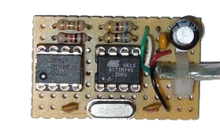
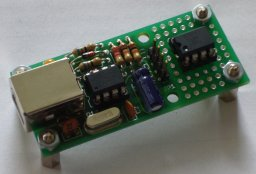
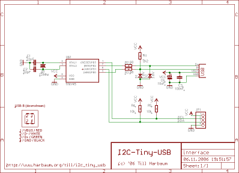
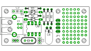
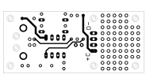
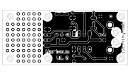
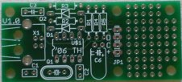
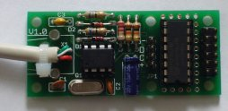
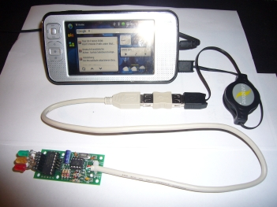
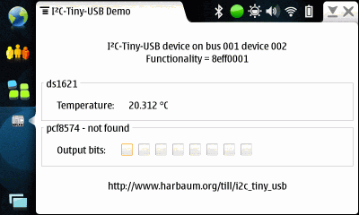

# i2c-tiny-usb

No custom hardware is needed anymore since the i2c-tiny-usb firmware has been [ported to the digispark](https://github.com/harbaum/I2C-Tiny-USB/tree/master/digispark).

## Introduction

Attach any I2C client chip (thermo sensors, AD converter, displays, relais driver, ...) to your PC via USB ... quick, easy and cheap! Drivers for Linux, Windows and MacOS available.

The i2c-tiny-usb project is an open source/open hardware project. The goal of i2c-tiny-usb is to provide a cheap generic i2c interface to be attached to the usb. It is meant as a replacement for those simple and cheap printer port to i2c adapters. A USB solution has several advantages incl. the built-in power supply and a more future proof interface. Furthermore no cpu intense bitbanging is required on the host side. This USB solution even requires less parts than some printer port solutions.

While the i2c-tiny-usb was developed under and for Linux it also works under Windows and MacOS X. A windows demo driver and demo application is included to get you started immediately.

The i2c-tiny-usb project is based on:

*   The [Linux USB project](http://www.linux-usb.org/) and the <a hreh="http://www.kernel.org">Linux i2c</a> implementation
*   The windows driver and test application are based on [the libusb-win32](http://libusb-win32.sourceforge.net/)
*   [AVR-USB, a pure software implementation of USB for the AVR platform](http://www.obdev.at/products/avrusb/index.html)
*   [USBtiny, another software usb implementation for the AVR](http://www.xs4all.nl/~dicks/avr/usbtiny/)

## Hardware

 | 
---- | ----
**The prototype board including** | **The final hardware with**
**a ds1621 temperature sensor** | **the same sensor added**

The hardware of the i2c-tiny-usb interface consists of the [Atmel AVR ATtiny45 CPU](http://www.atmel.com/dyn/products/product_card.asp?part_id=3618), a cheap and easy to obtain microcontroller with 4 KBytes flash (of which ~2k are used in this application) and 256 Bytes RAM. The processor is surrounded by few other parts.

### The USB interface

The USB interface of the i2c-tiny-usb interface is based on a pure software implementation and uses two pins of the AVR (PB0 and PB2). This software implementation supports low speed USB only which is signalled to the PC by resistor R1.

The I2C interface is implemented using a bitbanging approach. The hardware supported twi interface of the attiny45 is bound to hardware pins at the chip that are required for USB operation and can thus not be used for I2C. The bitbanging I2C interface being used instead may not be fully I2C compatible and thus not every I2C client chip may function correctly at this bus. No incompatibilities have been reported so far. The i2c-tiny-usb provides a software adjustable i2c clock delay allowing to configure the i2c clock. The default delay is 10us. Due to additional delays in the i2c bitbanging code this results in a i2c clock of about 50kHz.

For simplicity reasons all USB transfers are done via the control endpoint. Since the avr usb library does only support low speed devices it cannot use bulk transfers which are specified for high and full speed devices only. Low speed devices support so called interrupt transfers which are limited to a preset bandwidth while control transfers can use any free bandwidth (if there's any at all).

The device therefore uses control transfers for all of its communication. This requires some additional limitation to prevent multiple driver software (e.g. the kernel driver and the libusb based test application) to access the device at the same time. Under Linux this can be achieved by selecting certain access request types. This kind of access control may not be possible under other operating systems.

### Power consumption

The whole device is a so called bus powered device. This means that the complete device is powered directly from USB. Therefore the AVR and one or more I2C client chips are powered from the USB VBUS signal.

The adapter itself draws less than 10mA and reports this to the host via its USB descriptors. The device is able to power I2C client chips as well. But since these chips vary in power consumption it is not possible to correctly include their demands into the device descriptors. It's your responsibility to keep an eye on the total power supply and especially to make sure that the entire device does not exceed the total USB limit of 500mA.

It is planned for future firmware versions to make the reported power consumption software configurable so the value can easily be adopted to the real power demands of the entire device.

### Kernel driver

The i2c-tiny-usb is meant to be used with Linux. It comes with a Linux kernel driver that bridges between the USB and I2C subsystems in the Linux kernel. The driver then attaches to the USB device and make the i2c bus available to the i2c subsystem. Thus the entire setup is transparent to client applications like the [lm_sensors](http://www.lm-sensors.org/) framework and no special client chip drivers are required. Instead the drivers already present in the linux kernel are used with the i2c-tiny-usb as well. With e.g. the ds1621 temperature sensors used in the prototype the output of sensors may e.g. look like this:

<pre>ds1621-i2c-2-48
Adapter: i2c-tiny-usb at bus 003 device 017
temp:     +21.50°C (low  = +15.0°C, high = +10.0°C)  ALARM (HIGH)
</pre>

### Schematics and PCB

The zener diodes in the schematic are optional. They may be required since the i2c-tiny-usb is directly powered from the USBs VBUS singnal at 5V. The USB data lines (D+ and D-) are supposed to be operated at 3.3V only. Some PCs encounter problems at 5V and limiting the voltage to at most 3.6V may help. My prototype lacks these diodes since my PC works fine with D+ and D- at 5V.

Resistor R1 is 2k2 instead of 1k5 for the same reason. It is meant to pullup to 3.3V. Since we are pulling up to 5V the higher resistance is required.

Below is the final PCB layout. It consists of the USB and I2C parts only and does not include a I2C client chip. Instead it comes with a solder area for easy prototyping. I do have some of these PCBs left. Just drop me an email if you want to buy one (6 EUR per PCB + 4 EUR shipping). You can easily etch a PCB youself. Since most of the connections are on the bottom side even a single sided PCB will work. You'll just have to add the four missing connections using thin wires.

 |  |  | 
---- | ---- | ---- | ----
**Part placement** | **Top PCB side** | **Bottom PCB side** | **The final PCB**

The USB connector space on the PCB provides two additional holes to allow an USB cable to be directly and firmly attached to the device without the use of the USB connector. See the image below for the desired pinout.

 | 
---- | ----
**Direct cable wiring schema ...** | **... and in reality (with pcf8574 client).**

### Part list

You can get all parts directly via [my i2c-tiny-usb part list at Reichelt](http://www.reichelt.de/?ACTION=20;AWKID=50364;PROVID=2084). This list includes the following parts:

Part | Qty | Name | [Reichelt Part No.](http://www.reichelt.de)
---- | ---- | ---- | ----
D1, D2 | 2 | 3.6V zener diode | ZF 3,6
Q1 | 1 | 12Mhz crystal, HC49U package | 12,0000-HC49U-S
R1 | 1 | 2.2 kilo ohm resistor | 1/4W 2,2k
R2, R3 | 2 | 68 ohm resistor | 1/4W 68
R4, R5 | 2 | 10 kilo ohm resistor | 1/4W 10k
C1, C2 | 2 | 22pF ceramic capacitor, 2.54mm | KERKO 22P
C3 | 1 | 100nF capacitor, 5.08mm | X7R-5 100N
C6 | 1 | 10μF electrolytic capacitor | RAD 10/35
-- | 1 | USB-B print connector | USB BW
JP1 | 1 | 4 pin I2C connector | SL 1X36G 2,54
U$1 | 1 | Attiny45 DIP 20Mhz | ATTINY 45-20PU
-- | 1 | socket for U$1 | GS 8P

## Compiling the firmware

The ATtiny45 is quite new and thus not all parts of the developement chain support this chip in their current release versions. The latest binutils (linker an assembler) and avrdude (programmer) support the new chips as well but gcc doesn't. The gcc-4.1.0 has to be patched to support some AVR cpus incl. the attiny45\. Get the latest avr device patches (patch-newdevices) e.g [here](http://www.freebsd.org/cgi/cvsweb.cgi/ports/devel/avr-gcc/files/).

## Uploading the firmware

If you are familiar with Atmel programming you probably know what you are doing. The Makefile in i2c-tiny-usb/firmware/Makefile assumes, that you are using the [stk500](http://www.atmel.com/dyn/products/tools_card.asp?tool_id=2735) for programming the attiny45\. Since all 6 user configurable pins of the ATtiny45 are required, the so called high voltage serial programming (hvsp) mode of the attiny45 has to be used. E.g. the [stk500](http://www.atmel.com/dyn/products/tools_card.asp?tool_id=2735), the [AVR-Doper](http://www.obdev.at/products/avrusb/avrdoper.html) and the [AVR Dragon](http://www.atmel.com/dyn/products/tools_card.asp?tool_id=3891) are supporting this mode.

Two versions of the firmware can be compiled which are based on different USB software implementations for the AVR. If in doubt use the pre-compiled firmware.hex file distributed with the source code.

## Troubleshooting

Problem: The device seems to work fine, it is detected correctly by Linux, but i get various error messages when accessing it from the test application.

Solution: First make sure that the kernel driver is not loaded when trying to use the libusb based test application. Since the kernel driver is part of the main kernel line, it may even be already installed on your system. Type <tt>rmmod i2c_tiny_usb</tt> to remove it. Also make sure that you run the test application as the root user since the standard user may lack the rights to access all aspects of the i2c_tiny_usb hardware.

Problem: The device is not properly detected. Linux reports an error like "device not accepting address" in the system log.

Solution: The USB interface is not working at all. Please make sure that the AVR CPU is correctly flashed **and** that the fuses are set correctly. Another reason may be that the zener diodes are too slow (see next problem).

Problem: The device is not properly detected. Linux reports an an error like "device descriptor read/all, error -71" in the system log.

Solution: The device is working partly and the USB transfers are unreliable. This is often cauesed by "slow" high current zener diodes. On a previous reichelt list i had those wrong zener types. These slow diodes often seem to have thicker wires than the other parts. You can just try to remove the zener diodes and the device will work if your host PC copes with 5V on the USB data lines. Also using a USB hub between a device without zener diodes and the PC may lead to a working setup. Otherwise you need faster diodes as a replacement (reichelt no "zf 3,6" as on the current reichelt list).

## Using the device with a Nokia N800

The i2c_tiny_usb works at various hosts. One of the most interesting ones is the [Nokia N800](http://www.nseries.com). You need to [enable USB host mode capabilities on your N800](http://www.harbaum.org/till/n800_usb) to make use of the i2c-tiny-usb.

The demo application (contained in the i2c_tiny_usb archive) can easily be installed on the N800 from the harbaum.org repository using the install button below. Once it's installed it can be run from extras menu. The current version comes with a udev rules file granting user access to the i2c-tiny-usb and thus not requiring root rights anymore. Below is a screenshot of my n800 with a ds1621 equipped i2c-tiny-usb.

The <tt>i2c_usb</tt> demo application currently supports two I2C client chips, a ds1621 temperature sensor and a pcf8574 parallel port driver (with some LEDs attached to it, so you can see what's happening). Further chips can easily be supported, just use the source above ... Happy hacking with the N800!

## Links

*   [AVR-USB, software USB for the AVR platform](http://www.obdev.at/products/avrusb/index.html)
*   [USBtiny, another software usb implementation for the AVR](http://www.xs4all.nl/~dicks/avr/usbtiny/)
*   [USB user space library libusb](http://libusb.sourceforge.net/)
*   [Win32 port of libusb](http://libusb-win32.sourceforge.net/)
*   [The Linux USB Project](http://www.linux-usb.org/)
*   [Lm_sensors - Linux hardware monitoring](http://www.lm-sensors.org/)

## User contributions

*   [BLIT2008 board being used via the i2c-tiny-usb firmware](http://bralug.de/wiki/BLIT2008-Board_mit_i2c-tiny-usb-Firmware)
*   [Henning Pauls i2c-tiny-usb](https://web.archive.org/web/20161015190723/http://home.arcor.de/henning.paul/gallery/avr/)
*   [Barry Carters feature extended version](http://www.headfuzz.co.uk/?q=USBtoI2C)

* * *

[Till Harbaum](mailto:till@harbaum.org)

http://www.harbaum.org/till
