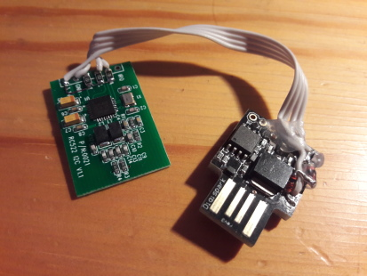
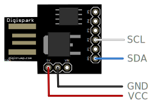

# I2C-Tiny-USB on Digispark and Adafruit Trinket

The i2c-tiny-usb firmware has been ported to the
[digispark](http://digistump.com/products/1) and the
[Adafruit Trinket](https://www.adafruit.com/product/1501).
It currently only works on the 5V Trinket because the 3.3V version does not
officially support operation at 16MHz. The original port is
available [here](https://github.com/nopdotcom/i2c_tiny_usb-on-Little-Wire).

The version distributed here is compatible with the original i2c-tiny-usb
driver and e.g. works with the linux kernel driver. This page only
describes the digispark port. Further information about the i2c-tiny-usb
can be found in the [main github repository](https://github.com/harbaum/I2C-Tiny-USB).



Foto: rc522 i2c rfid reader connected to the digispark. 

## Pin mapping



```SDA``` is mapped to pin ```P0``` of the digispark. ```SCL``` is mapped to ```P2```.
```SDA``` is mapped to pin ```#0``` of the Adafruid Trinket. ```SCL``` is mapped to ```#2```.

### I2C pullup resistors

I2C requires ```SCL``` and ```SDA``` to be connected with pull-up
resistors to ```5V```.

It is recommended to connect one 10k resistor from pin ```P0``` to pin
```5V``` and one from pin ```P2``` to pin ```5V```.

Alternally you can comment out the ```I2C_IS_AN_OPEN_COLLECTOR_BUS```
definition in
[main.c](https://github.com/harbaum/I2C-Tiny-USB/blob/master/digispark/main.c#L186).
This will enable some CPU internal pullup resistors. These aren't very
precise. If you encounter problems with the internal pullups please
try external ones.

Without the pullup resistors the digispark will still be detected by
the PC but once you are trying to access the I2C bus it may run into a
timeout and you'll see e.g. the following message in the linux syslog:

```
[...] i2c i2c-4: failure writing data
```

In this case the watchdog will trigger and you can see the Adafruit Trinket to
enter the bootloader again.

## Flashing the firmware

A compiled binary named ```main.hex``` is available in the repository.

It can be flashed to the digispark board using the ```micronucleus``` tool
from the digispark arduino installation:

```
micronucleus --run --dump-progress --type intel-hex main.hex
```

or the Adafruit Trinket using (make sure to apply their config tweeks first):

```
avrdude -pattiny85 -cusbtiny -D -Uflash:w:main.hex
```

More details on this can be found [here](https://github.com/nopdotcom/i2c_tiny_usb-on-Little-Wire/wiki/BuildingOnLinux).
