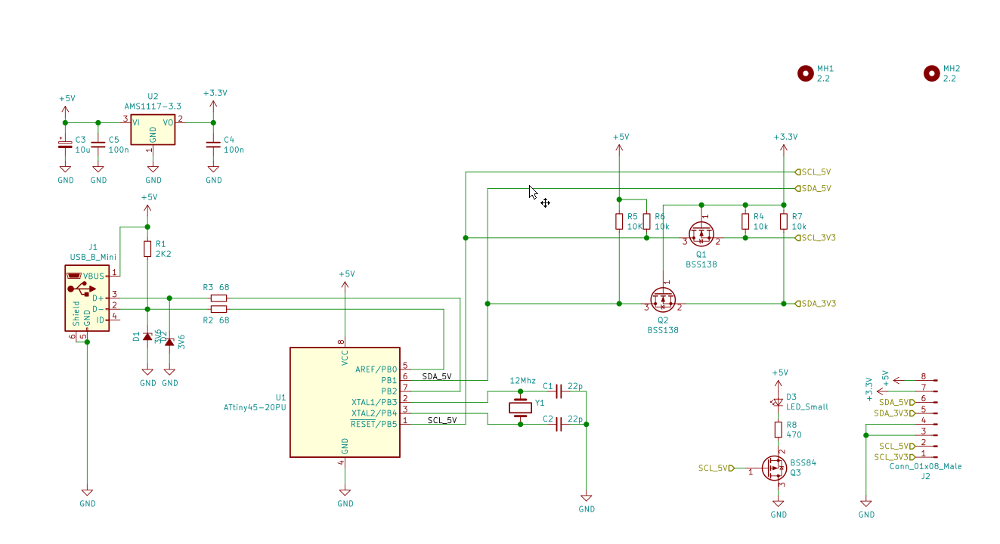
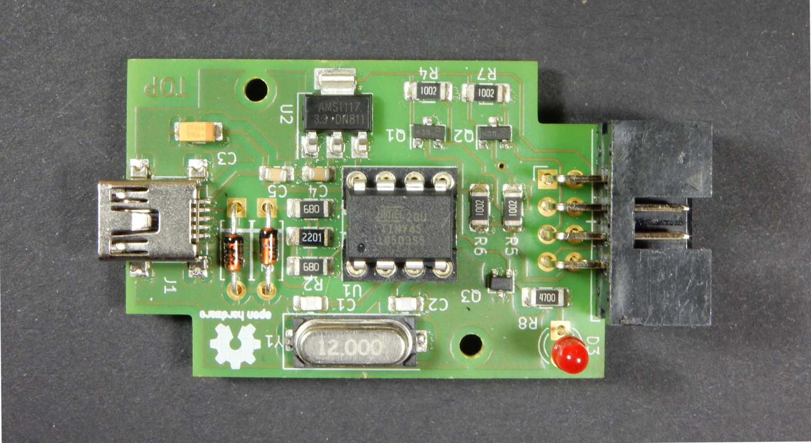
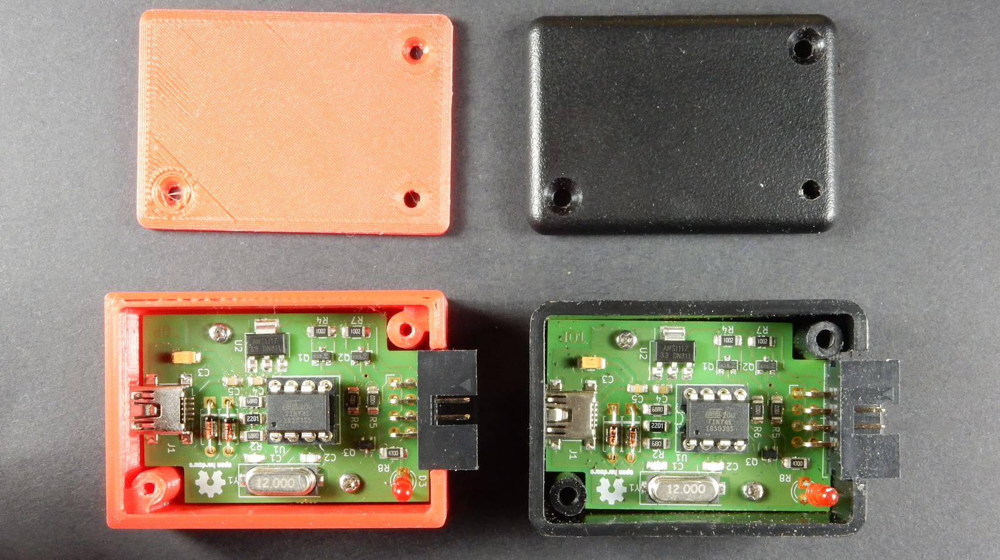
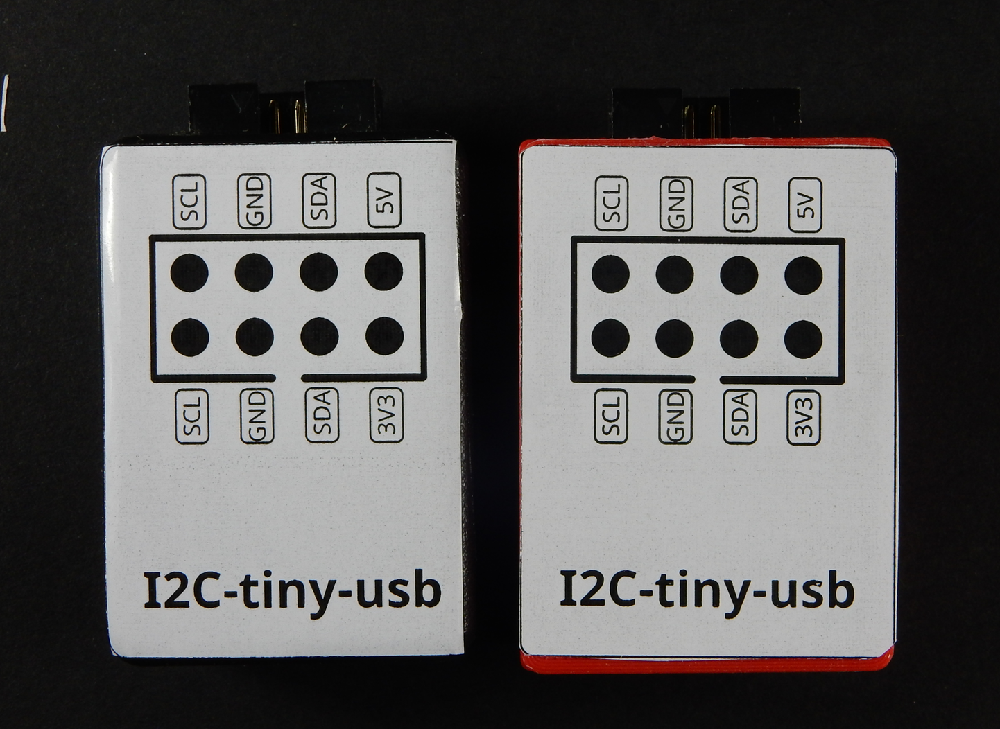

This is a modern re-spin of the PCB design. As a proto board version of
i2c-tiny-usb served me pretty well since years, I have decided that it deserves
a proper PCB and an enclosure. The board is designed to fit into the HM-1551GBK
Hammond box, but I've also designed a 3D printable enclosure, see in the
"enclosure" directory and on Thingiverse: https://www.thingiverse.com/thing:4261556.

The core of the schematic is pretty much as the original design, but it has a
3.3V regulator and a level shifter, so it can directly work with 3.3V devices,
and a LED on the i2c clock line:

The PCB is designed with mostly SMD parts and double sided, but I tried to keep
the number of vias minimal. Also the SMD parts are 1206, so it's possible to
build it on a homebrew PCB as well. I think it's also a good baseline if someone
wants to design an other board with modern Kicad. This is how a populated 
board look like (on a fab PCB):

And in the 2 enclosure types:

As a bonus, I also made a simple label with the pinout to stick it on the
enclosure:

